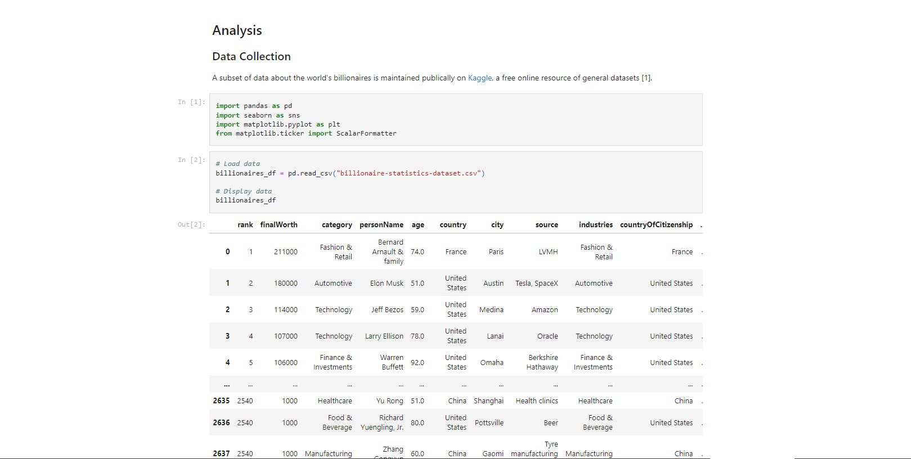
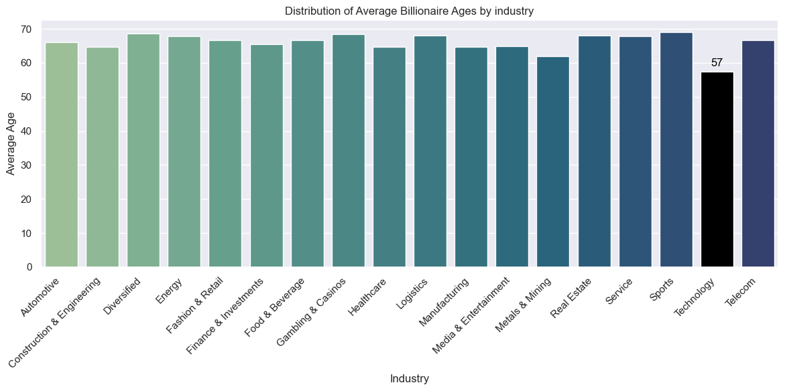
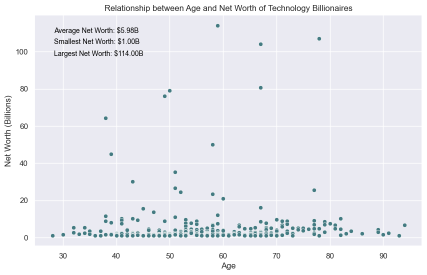
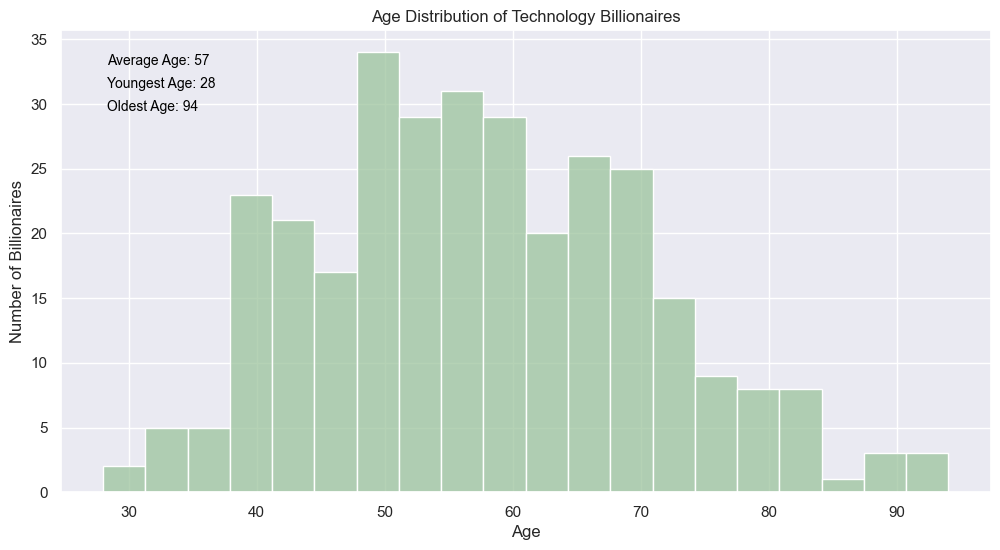

# Billionaires in the Technology Industry

## Overview
This analysis explores the dynamics of billionaires in the technology industry to uncover insights into the state of the technology sector.

### Preview

## Usage
To explore the analysis, open the [Jupyter Notebook file](https://github.com/reshawnlofters/tech-industry-billionaires-analysis/blob/main/tech-industry-billionaires-analysis.ipynb) (`tech-industry-billionaires-analysis.ipynb`) in the repository.

## Technologies Used
- Python, Pandas, Seaborn, Matplotlib, Jupyter Notebook

## Author
The Tech Industry Billionaires Analysis is developed and maintained by Reshawn Lofters. For inquiries, suggestions, or feedback, please contact Reshawn Lofters at reshawnalofters@gmail.com.

## Resources
The dataset used for this analysis can be found [here](https://www.kaggle.com/datasets/nelgiriyewithana/billionaires-statistics-dataset).