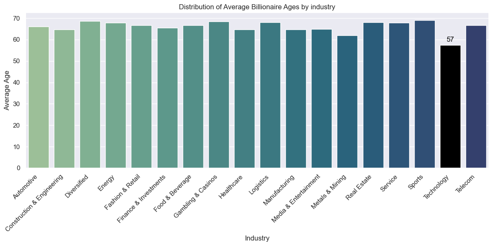
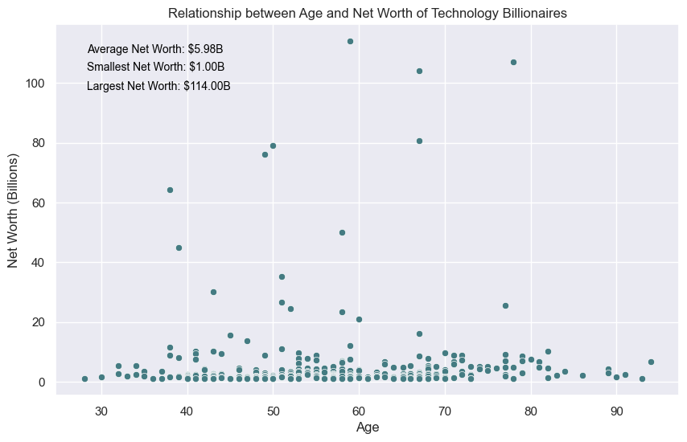
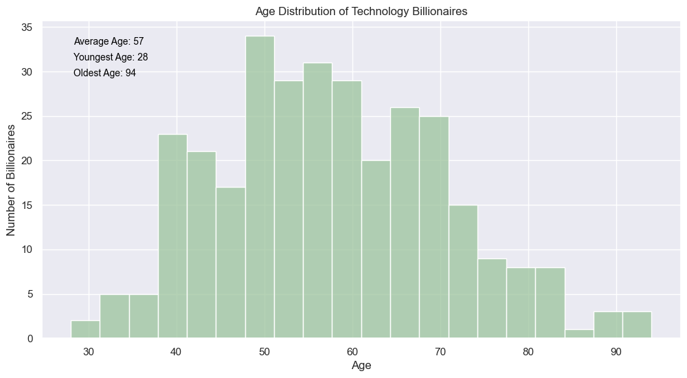

# Tech Industry Billionaires: Data Analysis

## Overview
This project is an analysis of tech industry billionaire data to extract sector insights and forecast industry trends. Key features include statistical pattern recognition, trend forecasting, and multi-variable correlation analysis.

**[View the Analysis Notebook](https://github.com/reshawnlofters/tech-industry-billionaires-analysis/blob/main/tech-industry-billionaires-analysis.ipynb)**

## Preview

## Key Features
- **Statistical Analysis**: Descriptive and inferential statistics using Pandas and NumPy to identify patterns and outliers.
- **Data Visualization**: Distribution and relationship modelling leveraging Seaborn and Matplotlib.
- **Trend Forecasting**: Historical data modelling to identify growth trajectories within specific sectors.
- **Correlation Mapping**: Analysis of net worth vs. age and industry variables to determine financial drivers.

## Tech Stack
Python, Pandas, NumPy, Seaborn, Matplotlib, Jupyter Notebooks

## Author
Reshawn Lofters: [LinkedIn](https://www.linkedin.com/in/reshawnlofters)

## Resources
Dataset: [Billionaries Statistics (Kaggle)](https://www.kaggle.com/datasets/nelgiriyewithana/billionaires-statistics-dataset)

## License
This project is licensed under a custom license. See the [LICENSE](./LICENSE) file for details.
